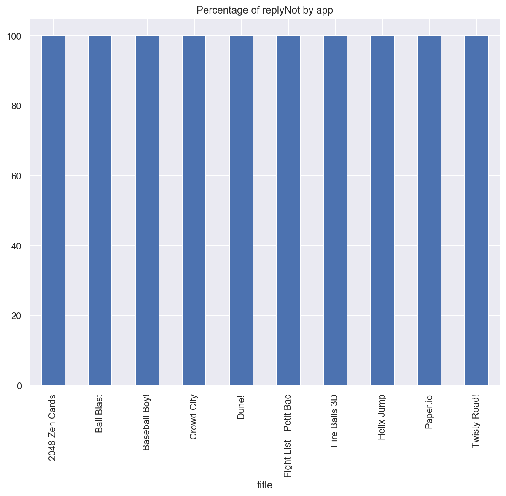

# Scrapping-Google-Play-App-Reviews-
## Project Overview:
- Scraped 10 apps details from google play store using google-play-scrapper package.

-Performed Exploratory Data anlysis on data to deliver insights to understand factors aids in increase of installation of app.

## Code and Resources used:
**Python:** 3.7.6.

**Packages Used:** google-play-scrapper,tqdm,matplotlib,plotly,seaborn,pandas,numpy

## Data Cleaning:
After loading the data I needed to clean it up.
Following are the changes made:
- Droped unnecessary columns.
- Fixed incorrect type and inconsistent formatting of Installs.

## EDA:

The following plot depicts the distribution of ratings.

To understand the which app is the newest and oldest.

How many times the app has been installed (after applying log transformation because data in the installs column has a broad range).

With the correlation data, it is proved that updated and type of app i.e free or paid are positively correlated with the installation.

Boxplot to show the relationship between the variables installs and type of app.

 In order to understand the sentiments of the reviewers, created the column sentiments where score below 3 consider as negative,score of 3 consider as neutral and above 3 consider as poitive.

Se how many times reviers does not get the replies from the app developer.

